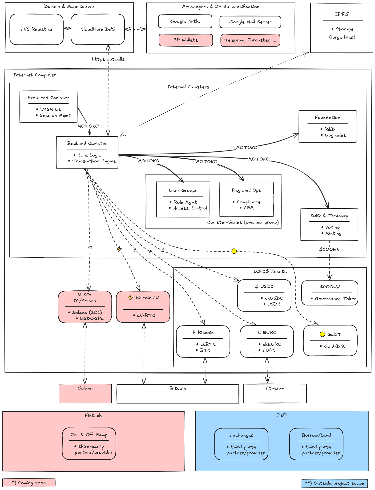

  

---

## Enterprise-Grade Financial Governance for Modern Organizations

*Admin-free digital wallets with built-in corporate controls for institutions, businesses and private groups*

**Key Stakeholder Controls:**  
- **Shareholders:** Govern budgets, executive appointments and payment approvals  
- **Managers:** Allocate funds, set spending limits and authorize transactions  

**Core Platform Features:**  
- Multi-signature shared wallets with role-based permissions  
- Digital shares enabling voting and capital formation  
- Automated compliance and dividend distributions  
- White-label deployment including private subnets  

**Security & Compliance:**  
- Institutional-grade security powered by Internet Computer Protocol  
- Embedded KYC/KYB/AML with regional adaptability  
- Complete audit trails for all transactions  

**The COOWN Advantage:**  
Bank-level security meets consumer-friendly design - delivering professional governance with intuitive operation for organizations of all sizes.

---
## 📑 Scope
This repository provides an overview of the technical framework.

Other repositories of COOWN's organization remain private, as the source code of the application is proprietary.

---
## 🔐 Licensing

• Free accounts without ledger - available for every natural person

• Free accounts with a ledger - available for residents of selected jurisdictions

• Annual enterprise licenses — available at coown.box

• Institutional white-label licenses e.g. for UTOPIA — available on request

---
## ▶️ Live Deployments  

### 🌐 Production  
Landing Page: [https://coown.box/](https://coown.box/)  

### 🧪 Beta (Testing Environment)  
Frontend Canister: [https://kgo7b-3qaaa-aaaap-an2dq-cai.icp0.io/](https://kgo7b-3qaaa-aaaap-an2dq-cai.icp0.io/)  

---
## ⚙️ Architecture  
### Tech Stack 
The decentralized application is primarely build on Internet Computer Protocol (ICP):  
- Frontend: JavaScript  
- Backend: Motoko  
Learn more: [internetcomputer.org](https://internetcomputer.org)  
Integrated services cover domain handling, messenger systems, storage, chain key technology, and interfaces to exchanges.

### Data Architecture Overview

---
## 📋 Requirements  
- Desktop or mobile device  
- Free Internet Identity: [identity.internetcomputer.org](https://identity.internetcomputer.org)  
- Verified email or messenger account  

---
## ⚠️ Limitations  
Cryptocurrency services are regulated in most jurisdictions.  

Key compliance features:  
- Regional KYC/AML programs  
- Operators may restrict accounts  
- DevOps cannot access or move user funds  

See [User and Privacy Policy](https://coown.box) for details.  

---
## 🚀 Get Started  
Follow us on social media, check out our explanatory videos, and access COOWN at:  
[coown.box](https://coown.box)  

---
