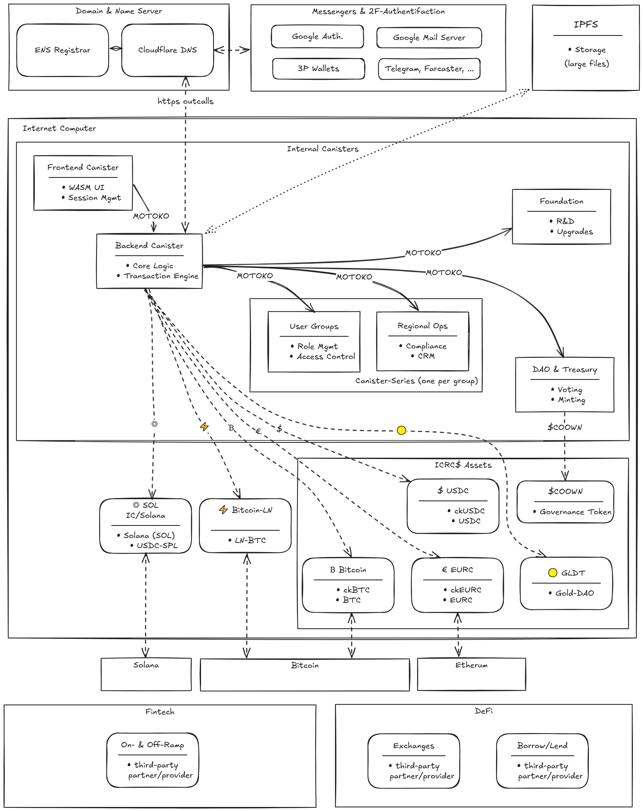

  

---

# COOWN

**Enterprise-Grade Financial Governance for Modern Organizations**

Admin-free digital wallets with built-in corporate controls for institutions, businesses, and private groups.

See our [Pitch Deck](https://www.notion.so/Pitch-Deck-5af3f45f2e3640a0874e60116f7de6aa) in the [Investor Data Room]([https://coown.notion.site](https://coown.notion.site/).

---

## Key stakeholder controls

- **Shareholders** — govern budgets, executive appointments, and payment approvals
- **Managers** — allocate funds, set spending limits, and authorize transactions

---

## Core platform features

- Multi-signature shared wallets with role-based permissions
- Digital shares enabling voting and capital formation
- Automated compliance and dividend distributions
- White-label deployment including private subnets

---

## Security & compliance

- Multi-layer security powered by Internet Computer Protocol, AWS, and Crossmint smart contracts
- Embedded KYC/KYB/AML with regional adaptability
- MiCA-aligned stablecoin compliance via Crossmint on Base network
- Fiat EUR integration with full IBAN/SEPA support via Monerium (LHV banking license)
- Complete audit trails for all transactions

---

## The COOWN advantage

Bank-level security meets consumer-friendly design — delivering professional governance with intuitive operation for organizations of all sizes.

---

## 📑 Scope

This repository provides an overview of the technical framework.

Other repositories within COOWN's organization remain private, as the application source code is proprietary.

---

## 🔐 Licensing

- Free accounts without ledger — available for every natural person
- Free accounts with a ledger — available for residents of selected jurisdictions
- Annual enterprise licenses — available at [coown.finance](https://coown.finance)
- Institutional white-label licenses (e.g. for regional operators) — available on request

---

## ⚙️ Architecture

### Tech stack

COOWN is a multi-layer decentralized application combining on-chain governance with modern cloud and fintech infrastructure:

- **Internet Computer Protocol (ICP)** — group governance engine: shareholder records, role-based access control, spending limits, and DAO/treasury functions. Each registered group runs as a dedicated canister. Learn more: [internetcomputer.org](https://internetcomputer.org)
- **Crossmint (a) — smart contracts on Base network** — USDC ledger and compliance layer aligned with MiCA; handles stablecoin issuance and settlement on Ethereum L2.
- **Crossmint (b) — interoperability, cards, ramps** — cross-chain bridging, Solana (USDC-SPL) integration, card issuance, and on/off-ramp infrastructure.
- **Monerium** — fiat Euro integration via IBAN/SEPA using LHV's banking license; enables direct EUR deposits and withdrawals linked to EURC on-chain.
- **AWS frontend** — web application hosting and session management at [coown.finance](https://coown.finance).
- **Cloud storage (IPFS)** — large file and document storage.
- **Mail & messengers** — 2FA, notifications, and user verification via Google Auth, email, Telegram, and Farcaster.

Primary programming languages: **JavaScript** (frontend), **Motoko** (ICP backend canisters), **Solidity** (Base smart contracts via Crossmint).

### Data architecture overview

The architecture is organized in four main layers:

1. **External services** — DNS (ENS + Cloudflare), authentication (Google Auth, Internet Identity), messengers (Telegram, Farcaster, 3P wallets), and cloud storage (IPFS).
2. **AWS frontend** — web application, identity/KYC login, and foundation admin.
3. **ICP layer** — backend canister (core logic, transaction engine), group canister series (one per registered group: user groups with role management + regional ops with compliance/CRM), and DAO & treasury (voting, $COOWN minting).
4. **Crossmint layer** — Base network smart contracts (USDC/MiCA), interoperability and Solana bridging, and card/ramp infrastructure. Monerium sits alongside as the fiat EUR on/off-ramp.

Supported digital assets: **USDC** (ckUSDC, USDC, USDC-SPL), **EURC** (ckEURC, EURC via Monerium IBAN), **Bitcoin** (ckBTC, BTC, Lightning), **GLDT** (Gold-DAO), and **$COOWN** (governance token, multi-chain ICP + Base).

Third-party fintech partners handle fiat on/off-ramping. DeFi integrations (exchanges, borrow/lend) are outside the current project scope and will be served by third-party providers.

---

## 📋 Requirements

- Desktop or mobile device
- Internet Identity: [identity.internetcomputer.org](https://identity.internetcomputer.org)
- Verified email or messenger account

---

## ⚠️ Limitations

Cryptocurrency services are regulated in most jurisdictions.

Key compliance notes:

- European banking licensed IBAN accounts via partner organization (LHV pank, Monerium)
- MiCA compliance enforced at the smart contract level via Crossmint on Base
- Regional KYC/AML programs apply depending on user location via banking and wallet providers
- Operators may restrict account access based on local regulations
- DevOps cannot access or move user funds

See [User and Privacy Policy](https://www.notion.so/Policies-fbee57f2a1f64bce8012890b0dece92e) for details.

---

## 🚀 Get started

Follow us on social media, watch our product demos, and access COOWN at [coown.finance](https://coown.finance).

---
